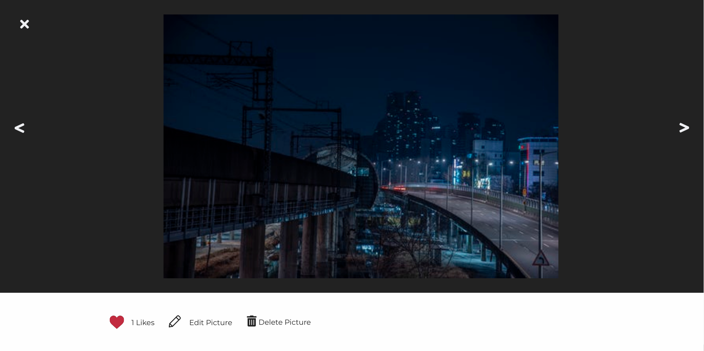
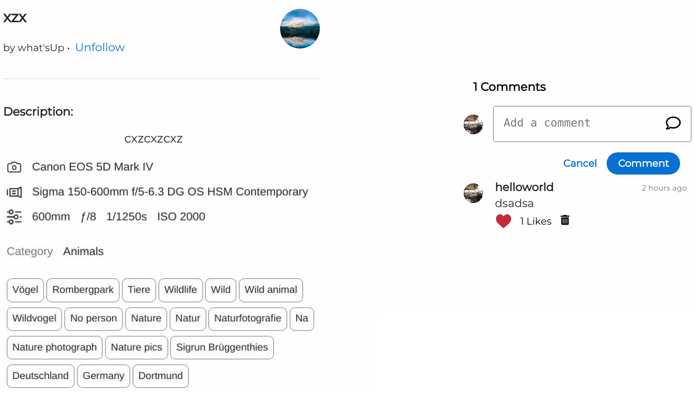

# 500.5px

500.5px is a single-page, web app clone of 500px, an online pohotography portfolio site.
500.5px uses a Ruby on Rails backend, with PostgresSQL as the database. React and Redux 
constitute the frontend of the web app.   

# Key Features 

# User Profiles 

Users can sign in, sign up or use the demo login to try the website. 

# Uploading Photos 

Users can upload their pictures to the website

Users can visit the picture show page to edit pictures, delete pictures, comment, like or follow the artist.

# Profile Page 

Users can visit other users' profiles. On the profile, users can see all the pictures uploaded by other users,
follow the user, see the followers, and people followed of that user. In their own profile page, users can change 
their background or profile pictures.

# Feed page

After signing in or signing up, users are taken to the feed page

# Development Log

# Week 1

* Made authentication 
* Finished the Splash page 
* created backend for Pictures using aws 
* Made backend for Likes, Follows and Comments

# Week 2

* Made Picture Show page, Likes for Pictures
* Added feature to edit and delete pictures
* Made Comments feature
* Added Likes to Comments
* Made Profile page
* Added Follows feature 
* Added deleting Comments feature
* Added feature to change background and Profile Picture
